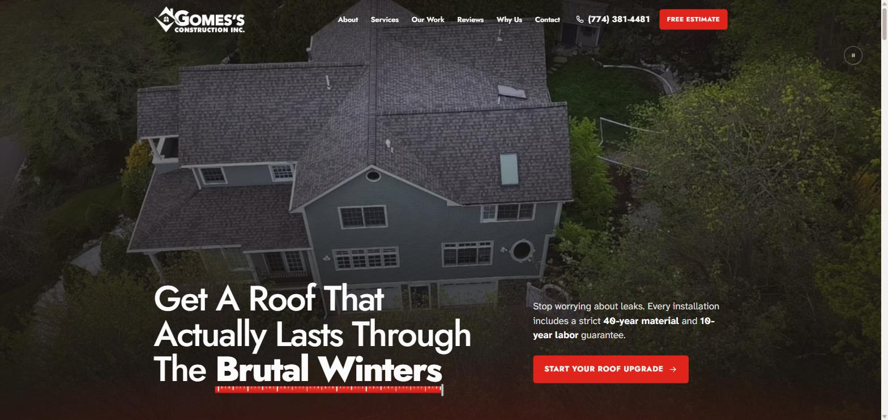
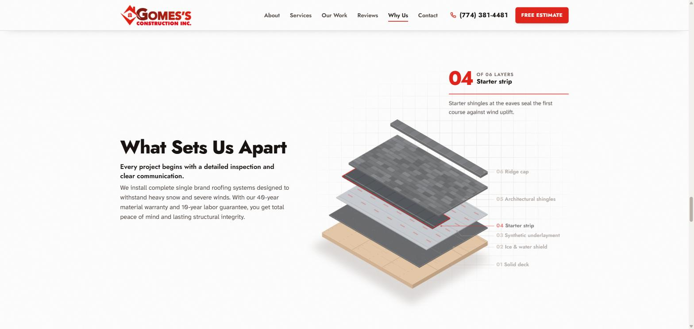
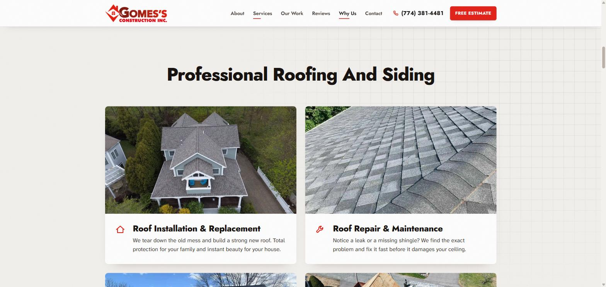
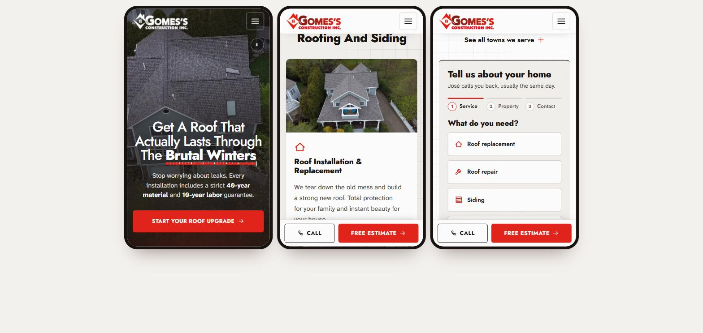

<div align="center">


# Gomes's Construction Inc. — Website

**One page de geração de leads para roofing, siding e insurance restoration em Brockton, MA.**

[](https://gomes.escolats.com.br)


</div>

<br>

<p align="center">
  
</p>

---

## Sobre o projeto

Site institucional one page da **Gomes's Construction Inc.**, empresa de telhados e siding com sede em Brockton, Massachusetts. O objetivo é transformar o tráfego do Google Ads, do Meta Ads e do Google Business Profile em pedidos de orçamento e ligações.

A identidade parte da logo do cliente: o gradiente **bordô `#7A1A12` → vermelho `#E3241B`**, a tipografia geométrica pesada e a casa dentro do losango. O conceito visual é o do **sistema de telhado em camadas**: o site mostra, camada por camada, o sistema CertainTeed completo que sustenta a garantia de 40 anos de material e 10 anos de mão de obra.

## Destaques

| | |
|---|---|
| 🎬 **Hero cinematográfico** | Vídeo real de drone em tela cheia e título em três linhas, com uma trena animada sob *Brutal Winters*. |
| 🧱 **Diagrama do sistema de telhado** | Corte isométrico em SVG gerado por código. No scroll, as 6 camadas se separam, com lista de peças, contador e selo 40/10 no final. |
| 🖼️ **Galeria em carrossel** | Loop infinito, rolagem automática lenta, arraste com inércia (mouse e toque) e navegação por teclado. |
| ⭐ **Reviews reais** | 14 avaliações do Google em duas fileiras de marquee, em sentidos opostos, com pausa no hover. |
| 📝 **Formulário em 3 etapas** | Serviço → imóvel → contato, com validação por etapa. Integrado ao Web3Forms. |
| 🗺️ **Contato e área de atendimento** | Google Maps, cards de telefone e e-mail e as cidades atendidas em chips. |
| 📱 **Mobile revisado** | Layout testado em 320, 360, 390 e 414 px, sem rolagem horizontal. Inclui barra fixa de *Call / Free Estimate*. |
| ♿ **Acessível** | Respeita `prefers-reduced-motion` e tem foco visível, skip link, textos alternativos e alvos de toque grandes, pensando no público de 22 a 70 anos. |

<p align="center">
  
  
</p>

<p align="center">
  
</p>

## Identidade

| Token | Valor | Uso |
|---|---|---|
| `--red` | `#E3241B` | Ação, destaques, a trena e o selo |
| `--brick` | `#7A1A12` | Hover e profundidade (início do gradiente da logo) |
| `--ink` | `#17120F` | Texto e rodapé |
| `--paper` / `--paper-2` | `#FFFFFF` / `#F3F1EE` | Fundos, papel técnico |
| Display | **Jost** 500–800 | Linhagem Futura, a mesma da logo |
| Texto | **Atkinson Hyperlegible Next** | Máxima legibilidade para todas as idades |

## Estrutura

```text
.
├── index.html            # página única
├── 404.html              # página de erro com a marca
├── assets/
│   ├── css/styles.css    # todos os estilos (tokens no :root)
│   ├── js/main.js        # interações: diagrama, carrosséis, form, mapa…
│   ├── img/              # fotos reais de obras e drone
│   ├── video/            # vídeo de drone do hero + poster
│   ├── badges/           # selos CertainTeed
│   └── logo/             # logos e favicon
├── docs/                 # imagens deste README
├── .htaccess             # HTTPS, cache, gzip, headers e noindex no staging
├── robots.txt · sitemap.xml
└── CNAME · .nojekyll     # suporte a GitHub Pages
```

## Rodando localmente

Não há build nem dependências. Basta servir a pasta:

```bash
# qualquer servidor estático serve
npx serve .
# ou
python -m http.server 8080
```

Depois é só abrir `http://localhost:8080`.

## Deploy

### Staging — `gomes.escolats.com.br`

**Hospedagem com cPanel / Apache:** envie todos os arquivos da raiz para a pasta do subdomínio, incluindo o `.htaccess`, que é um arquivo oculto.

**GitHub Pages:** em *Settings → Pages*, escolha *Deploy from branch → `main` / root*. O arquivo `CNAME` já aponta para `gomes.escolats.com.br`. No DNS, crie um registro **CNAME** `gomes` → `pedroagostini.github.io`.

> 🔒 O staging fica **fora do Google** automaticamente. O `.htaccess` envia `X-Robots-Tag: noindex` e o `index.html` injeta `<meta name="robots" content="noindex">` quando o host termina em `escolats.com.br`. Na produção nada disso é aplicado.

### Produção — `gomessroofing.com`

1. Remova ou atualize o arquivo `CNAME` para o domínio final.
2. Confira a chave do Web3Forms (veja a seção seguinte).
3. Envie o `sitemap.xml` no Google Search Console.

## Antes de ir para produção

- [ ] **Web3Forms:** trocar `YOUR_WEB3FORMS_ACCESS_KEY` em `index.html` pela chave real (gerada em [web3forms.com](https://web3forms.com) com o e-mail que vai receber os leads). Sem ela, o formulário mostra uma mensagem de erro com o telefone.
- [ ] **Conteúdo técnico:** validar com o José os textos das 6 camadas do sistema de telhado.
- [ ] **Área de atendimento:** a lista de cidades veio do site atual e ainda não inclui a South Shore (Plymouth, Taunton, Quincy…).
- [ ] **Licença:** informar o número da MA Home Improvement License, se o cliente quiser exibi-lo.

---

<div align="center">

Desenvolvido por **[Eu Sou TS](https://eusouts.com/)**

<sub>Fotos, vídeos, logos e avaliações pertencem à Gomes's Construction Inc.</sub>

</div>
